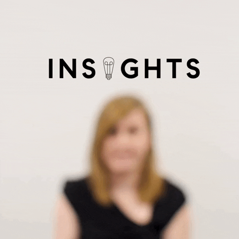

# Hi there! 👋 You've stumbled upon the digital space of Daina                                                                                                                                                                                                                                                                                                          

| 
<h2>❤️ What drives me</h2>Passionate about discovering patterns around me. Drawn to finding answers through research and insights. Inspired by visuals and the ability to change them through CSS. Love digging to the roots of the problem. <h2>Find me on</h2>
 |  | 
 
 |
|---|---|---|

  |                                                                                                                                                                                                                                                                                                                        |                                     |
|--------------------------------------------------------------------------------------------------------------------------------------------------------------------------------------------------------------------------------------------------------------------------------------------------------------------------------------|-------------------------------------------|
| <ul style="list-style-type: disc;"> <li>Passionate about discovering patterns around me.</li> <li>Drawn to finding answers through research and insights.</li> <li>Inspired by visuals and the ability to change them through CSS.</li> <li>Love digging to the roots of the problem.</li> <li>... and more!</li> </ul> |  |

# 👋 Hi there, I’m [Your Name]!

Welcome to my GitHub profile 🌍  
I’m a **creative thinker** with a love for **psychology**, **poetry**, and **digital strategy**.

## 🌟 What drives me
- 🎨 Creativity – from designing pages to writing thoughtful poems  
- 📊 Analytical mindset – fueled by data, insights, and optimization  
- 🧠 Curiosity – always learning, always exploring  
- 💬 Empathy – people and their behavior truly fascinate me  
- 🚀 Growth – professionally, personally, and technically

  

## 💼 What I do
- 🌐 Build and optimize websites (WordPress, HTML/CSS, SEO-first approach)  
- 📈 Study digital marketing, data analysis, and user experience  
- ✍️ Write content – including psychology-based articles and poetry  
- 📚 Constantly leveling up (currently at Turing College 🧑‍🎓)

## 📫 Let’s connect!
Feel free to reach out, collaborate, or just say hi!  
📩 [your.email@example.com]  
🌐 [yourwebsite.com]  
🔗 [LinkedIn](https://www.linkedin.com/in/your-profile)

---

🔧 *Always building. Always evolving.*

## 🌟 What drives me

This text might be in Arial.

| 

  <ul style="list-style-type: disc;">
    <li>Passionate about discovering patterns around me.</li>
    <li>Drawn to finding answers through research and insights.</li>
    <li>Inspired by visuals and the ability to change them through CSS.</li>
    <li>Love digging to the roots of the problem.</li>
    <li>... and more!</li>
  </ul>

 |  |
|---|---|

  

| 
🎥 **Demo**  This project demonstrates how text can overlay an image using HTML and CSS.
 |  |
|---|---|

| 
🎥 **About me 💬**  - I'm passionate about discovering patterns around me. I find joy in uncovering insights through research. I love experimenting with visuals and CSS tweaks. I'm passionate about discovering patterns around me.
 |  |
|---|---|

| 
🎥 **About me 💬**  I'm passionate about discovering patterns around me. I find joy in uncovering insights through research. I love experimenting with visuals and CSS tweaks. I'm passionate about discovering patterns around me.
 |  |
|---|---|

<table style="border-collapse: collapse; width: 100%;">
  <tr>
    <!-- First column: text -->
    <td style="border: none; vertical-align: top; padding-right: 20px;">
      <h2>🎥 Demo</h2>
      
1. First line 
         2. Second line 
         3. Third line

    </td>

    <!-- Second column: one larger GIF -->
    <td style="border: none; vertical-align: top; padding-right: 20px;">
      
    </td>

    <!-- Third column: two smaller GIFs stacked -->
    <td style="border: none; vertical-align: top;">
       
      
    </td>
  </tr>
</table>

<h3>About ME 💬 :</h3>
    <ul>
      <li>- I'm passionate about discovering patterns around me.</li>
      <li>- I find joy in uncovering insights through research.</li>
      <li>- I love experimenting with visuals and CSS tweaks.</li>
    </ul>
  
 

- 🔭 I’m currently exploring Digital Marketing & Analytics  on building my CV
- 🌱 I’m currently learning Digital Marketing at Turing College

### 🎯 What Drives Me
 <!-- 1. Text left, GIF right -->

  

    🔍 I’m passionate about discovering patterns in the data around me.
  

  

<!-- 2. Text right, GIF left -->

  
  

    🧠 I love digging to the root of the problem and figuring out *why*.
  

<!-- 3. Text top, GIF bottom with spacing -->

  

    🎨 I’m inspired by visuals — and I love tweaking them with CSS.
  

  

  

    <h3>About ME 💬 :</h3>
    <ul>
      <li>- I'm passionate about discovering patterns around me.</li>
      <li>- I find joy in uncovering insights through research.</li>
      <li>- I love experimenting with visuals and CSS tweaks.</li>
    </ul>
  

  

### Discovering Patterns 🔍

 I'm passionate about identifying underlying structures and connections in data, nature, and everyday life. The ability to recognize and analyze patterns is something I find deeply satisfying.
### Discovering Patterns 🔍

 I'm passionate about identifying underlying structures and connections in data, nature, and everyday life. The ability to recognize and analyze patterns is something I find deeply satisfying.

### Research & Insights 💡

The process of asking questions, conducting thorough research, and uncovering meaningful insights is a core driver for me. I enjoy the journey of seeking answers and understanding the "why" behind things. 

<h2>Hey, [Your Name] here! 👋</h2>

<h1>Welcome to my humble abode in the Digital World..</h1>

  There are 10 types of people in the world. Those who get Binary and those who don’t..

  

    <h3>💡 Technologies I Love</h3>
    <ul>
      <li>Digital Marketing & Analytics</li>
      <li>SEO & SEM</li>
      <li>Data Visualization</li>
      <li>Behavioral Psychology</li>
    </ul>
  

  

### Discovering Patterns 🔍

 I'm passionate about identifying underlying
### Research & Insights 💡

The process of asking questions, conducting thorough research things. 
<!-- GitHub renders this table without visible borders -->

### Visuals & CSS Magic ✨

I'm inspired by the power of visuals and the ability to shape them using CSS. 

| Text | GIF |
|------|-----|
| This project demonstrates how text can overlay an image using HTML and CSS. |  |

