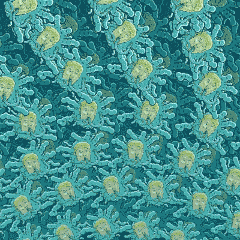
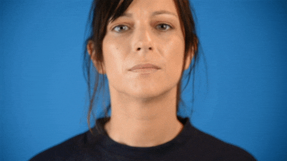
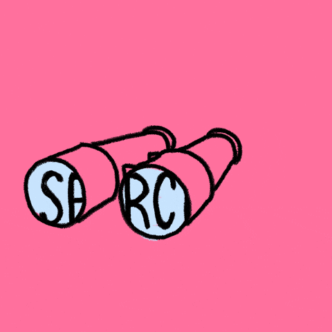

# Hi there! 👋 You've stumbled upon the digital space of Daina                                                                                                                                                                                                                                                                                                          

| 
*Digital marketing field digger with lenses on analytics and SEO*
 |  
 | 
 
 |
|---|---|---|

  |                                                                                                                                                                                                                                                                                                                        |                                     |
|--------------------------------------------------------------------------------------------------------------------------------------------------------------------------------------------------------------------------------------------------------------------------------------------------------------------------------------|-------------------------------------------|
| <ul style="list-style-type: disc;"> <li>Passionate about discovering patterns around me.</li> <li>Drawn to finding answers through research and insights.</li> <li>Inspired by visuals and the ability to change them through CSS.</li> <li>Love digging to the roots of the problem.</li> <li>... and more!</li> </ul> |  |

🔧 *Always building. Always evolving.*

| 
🎥 **Demo**  This project demonstrates how text can overlay an image using HTML and CSS.
 |  |
|---|---|

| 
🎥 **About me 💬**  - I'm passionate about discovering patterns around me. I find joy in uncovering insights through research. I love experimenting with visuals and CSS tweaks. I'm passionate about discovering patterns around me.
 |  |
|---|---|

| 
🎥 **About me 💬**  I'm passionate about discovering patterns around me. I find joy in uncovering insights through research. I love experimenting with visuals and CSS tweaks. I'm passionate about discovering patterns around me.
 |  |
|---|---|

| Text | GIF |
|------|-----|
| This project demonstrates how text can overlay an image using HTML and CSS. |  |

